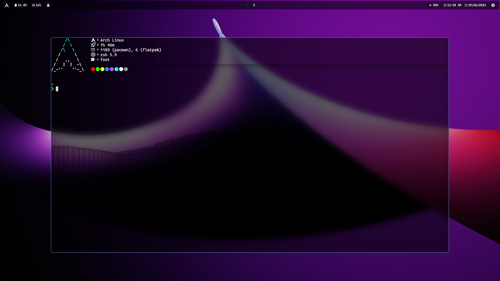

# dotfiles

This repository contains my personal dotfiles for Arch Linux. These dotfiles are tailored to my specific setup and preferences, serving as a reference or starting point for your own configuration.

## Specifications

| Component         | Software          |
|-------------------|-------------------|
| Operating System  | Arch Linux        |
| Window Manager    | Hyprland          |
| Terminal Emulator | Foot              |
| Shell             | Zsh               |
| Text Editor       | VSCode / Neovim   |
| Status Bar        | Waybar            |
| Launcher          | Rofi              |
| File Manager      | Thunar            |
| Notifications     | Mako              |
| Multiplexer       | Tmux              |
| Fetch             | Neofetch          |
| Font              | JetBrains Mono    |

Please note that these dotfiles are constantly evolving, and I may make changes or add new configurations over time. Feel free to fork this repository and adapt it to your own needs. If you have any questions or suggestions, please open an issue or reach out to me.